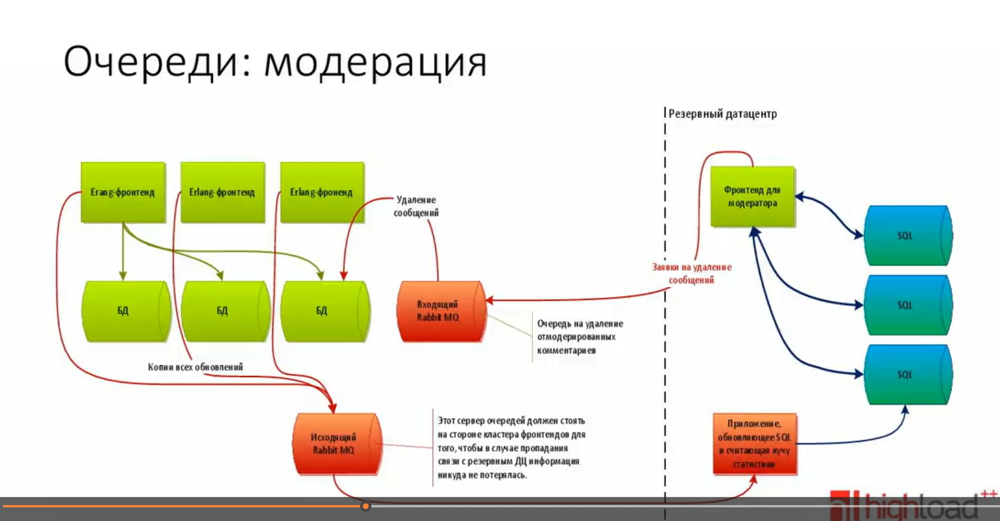

**Дата:** 8 ноября 2025 г.

**Статус:** Принято

**Контекст:**

При разработке сервиса фриланс биржи мы стоим перед выбором паттернов производительности и масштабирования.
Нам необходимо быть готовым к пиковым нагрузкам.
Из CAP мы выбираем AP - Доступность (Мастер-слейв легче реализовать, допускается задержка при чтении) и Допуск к разделению (несколько физических серверов)

**Рассмотренные варианты:**
1. **Трёхзвенная структура:**
- Презентационный (Frontend): Интерфейс пользователя (браузер, мобильное приложение). Фронтенд будет кешировать css и картинки
- Бизнес-логика (Backend): Сервер приложений, обрабатывающий команды пользователя, выполняющий расчеты и правила.
- Данные (Database): СУБД для хранения и управления данными.
2. **Кеширование:** Сохранение часто запрашиваемых или "тяжелых" для вычисления данных в быстродоступном хранилище (в памяти)
   для уменьшения времени отклика и нагрузки на базу данных. Инвалидация кеша с помощью тегирования
3. **Толстый клиент:** Перенос части логики и вычислительной нагрузки на сторону клиентского устройства (браузера или мобильного приложения).
SPA приложение, RESTFULL, после 504 ошибки отправка запроса через время на другой физ. сервере
4. **Деградация функциональности:** При высокой нагрузке или сбоях система автоматически отключает второстепенные функции, 
чтобы сохранить работоспособность ключевых. 
5. **Вертикальное масштабирование:** Увеличение мощности существующего сервера (больше CPU, RAM, быстрые диски).
6. **Функциональное разделение:** Разбиение монолитного приложения на отдельные, более мелкие сервисы, отвечающие за конкретную бизнес-область (домен).
Модульный монолит с чистой архитектурой
7. **Горизонтальное масштабирование:** Добавление большего количества серверов (нод) и распределение нагрузки между ними, для балансировки нагрузки
8. **SOA:** Микросервисы. Архитектурный стиль, при котором приложение состоит из множества слабосвязанных, независимо развертываемых сервисов, общающихся по сети - GRPC
9. **Монолитное приложение:** Вся логика приложения собрана в единую, неразделимую кодовую базу и развертывается как одно целое.
10. **Отложенные вычисления:** Вычисления выполняются только в момент, когда реально требуется их результат, а не заранее.
11. **Асинхронная обработка:** Выполнение длительных задач в фоновом режиме, без блокировки ответа пользователю. RabbitMQ
12. **Конвейер:** Разбиение сложной задачи на последовательность независимых этапов (фильтров), которые обрабатывают данные и передают их дальше по конвейеру.
13. **Репликация:** Создание и поддержание нескольких копий данных (реплик) на разных серверах. Чтение с реплик
14. **Вертикальный шардинг:** Разнные данные на разные физ сервера, разные СУБД/Типы СУБД
15. **Горизонтальный шардинг:** Разделение таблицы по строкам. Данные распределяются по разным шардам экземплярам СУБД на основе ключа шардирования остаток от деления user_id
16. **Виртуальные шарды:** Использование большого количества логических шардов (например, 1024), которые затем физически размещаются на меньшем количестве серверов. Это упрощает перераспределение данных при добавлении/удалении серверов.
17. **Центальный диспетчер:** Использование единого компонента (балансировщика нагрузки, шард-менеджера), который перенаправляет запросы на соответствующий сервер или шард.
18. **Партиционирование:** Разделние данных по разным таблицам например по датам, по цене
19. **Денормализация:** Нарушение нормальных форм, для ускоренной отдачи данных и медленной записи
20. **Введение избыточности:** Преднамеренное дублирование данных в разных таблицах для ускорения операций чтения за счет увеличения избыточности и сложности обновления.
21. **Паралелльное выполнение:** Разбиение одной задачи на подзадачи, которые выполняются одновременно на разных ядрах CPU или разных серверах, с последующей агрегацией результатов.
22. **Специализированные сервера:** Выделение отдельных серверов или сервисов для специфических, ресурсоемких задач. Elasticsearch
23. **Comet-серваер:** Паттерны для реализации "пуша" (push) уведомлений от сервера к клиенту в реальном времени без постоянных опросов (polling) со стороны клиента.

**Решение:**
- **Трёхзвенная структура**
- **Кеширование**
- **Толстый клиент**
- **Деградация функциональности**
- **Вертикальное масштабирование**
- **Горизонтальное шардирование + Вертикальное шардирование**
- **Горизонтальное масштабирование**
- **SOA**
- **Асинхронная обработка**
- **Центальный диспетчер**
- **Денормализация**
- **Comet-серваер**
- 
**Обоснование:**
- Трёхзвенная структура - основа веб-приложения клиент-серверного, кеширование стилей, img на nginx gzip 7
- Кеширование - кешироание для каждого пользователя каталога заказа. Кеш с ttl 5 минут.
Инвалидация кеша после добавление/удаление/редактирования заказа, подходящую под выборку пользователя 
Профиль пользователя ttl 30 минут, инвалидация после редактирования
- Толстый клиент - умение работать с пейджинацией, повторный запрос при 504 Толстый клиент 
- Деградация функциональности
- Вертикальное масштабирование - постепенное увеличения CPU и RAM на часто нагруженных серверах
- Горизонтальное шардирование + Вертикальное шардирование - 1 сервер 8 шардов(запущеных клиентов MYSQL) в mysql хранится пользователь, заказы, оплата
- Репликация - репликация щардов, реплик делать 2 на mysql СУБД, должны поддерживать failover, switchover
- SOA - envoy, весь функионал по сервисам, kubernetes для всех дисптечеров, сервисов, бд
- Асинхронная обработка - Модерация заказов, для избежания работы со злоумышлинниками 
- Конвейер с отложенной обработкой - после создания заказа, через время запустить конвейер модерации на спам, запрещённую деятельность
- Центальный диспетчер - nginx, шард менеджер

**Недостатки решения:**

- С ростом серверов и шардов рост точек отказа

**Последствия:**

-
